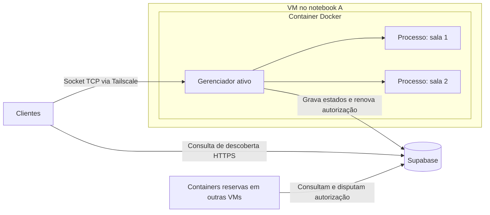

# Arquitetura — Jogo da Forca Distribuído

## Objetivo

Jogo cliente-servidor em Python, com até dois jogadores por sala, fila de espera e recuperação da mesma partida quando o servidor ativo cair.

## Componentes

| Componente | Responsabilidade |
| --- | --- |
| Cliente Python no terminal | Enviar tentativas, mostrar os dois bonequinhos e reconectar automaticamente. |
| Gerenciador do servidor | Receber conexões TCP, identificar jogadores e encaminhar mensagens às salas. |
| Processo por sala | Executar as regras e processar uma jogada por vez. |
| Servidores reservas | Aguardar autorização para assumir e reconstruir as salas pelo banco. |
| Supabase/PostgreSQL | Guardar sessões, espera e partidas; registrar servidores e controlar quem pode atender. |
| Tailscale | Conectar clientes e VMs pela rede privada, inclusive em redes físicas diferentes. |
| Docker Engine + Compose | Executar o servidor e suas dependências de forma padronizada dentro de cada VM. |

Infraestrutura inicial: dois notebooks físicos, cada um com uma VM Ubuntu Server no VirtualBox e um container do servidor Python. Tailscale instalado diretamente nas VMs e nos dispositivos clientes; as VMs podem usar NAT para acessar a internet.

Bibliotecas: `socket`, `json`, `threading`, `multiprocessing` e cliente Python do Supabase. Filas de `multiprocessing` conectam o gerenciador aos processos locais das salas.

## Organização

Um único servidor atende por vez. Os reservas aumentam a tolerância a falhas; as salas executam no servidor ativo.

**Interpretação de nó:** cada nova sala cria um processo Python independente. Essa interpretação deve ser validada com o professor caso “nó” exija uma VM ou máquina adicional.

## Execução com Docker

- Um container por servidor, contendo o gerenciador e os processos das salas. Novas salas são criadas com `multiprocessing` dentro desse container.
- Ativo e reservas usam a mesma imagem; cada instância recebe seu identificador e endereço anunciado por configuração. A autorização no Supabase determina quem atende.
- `Dockerfile` define Python, dependências e código; `compose.yaml` configura a execução separadamente em cada VM. `.dockerignore` exclui arquivos desnecessários e segredos da imagem; `.env.example` documenta configurações sem credenciais reais.
- O servidor escuta em `0.0.0.0:5000` dentro do container. O Compose publica essa porta na VM, acessível pelo Tailscale. A descoberta anuncia o endereço Tailscale da VM e a porta publicada.
- Credenciais são fornecidas em tempo de execução, fora da imagem e do Git. O Supabase permanece hospedado na nuvem; estados locais são reconstruídos pelo banco após reinícios.
- O Docker pode reiniciar o container na mesma VM. A recuperação após a queda do notebook continua sendo feita pelos reservas e pela reconexão dos clientes.

## Entrada e comunicação

1. O cliente consulta um endereço fixo do Supabase para descobrir o servidor ativo.
2. Recebe o endereço Tailscale e a porta e abre uma conexão TCP.
3. O servidor cria uma sessão ou recupera a sessão apresentada pelo cliente.
4. Havendo sala com um jogador aguardando, o novo jogador ocupa a vaga e inicia a partida.
5. Caso contrário, cria uma sala e seu processo; o jogador aguarda adversário.

A espera segue a ordem de chegada. Cada sala tem no máximo dois jogadores. Todos os clientes usam a mesma porta de entrada; o gerenciador encaminha as mensagens ao processo correto.

Protocolo: JSON em UTF-8, uma mensagem por linha. O receptor acumula bytes e separa mensagens completas, pois um `recv()` pode retornar mensagens parciais ou agrupadas. Mensagens principais: entrar, retomar sessão, enviar tentativa e receber estado.

## Partidas e armazenamento

O servidor valida o jogador da vez e rejeita tentativas fora do turno. Após cada jogada confirmada, envia aos dois clientes a palavra parcial, letras tentadas, erros individuais, próximo turno e resultado. A palavra secreta permanece no servidor e no banco durante a partida.

| Dados | Conteúdo mínimo |
| --- | --- |
| Sessões | Jogador, hash do token de reconexão e sala. O cliente guarda o token original. |
| Salas e partidas | Participantes, ordem de espera, situação, palavra, tentativas, erros, turno e versão. |
| Jogadas | Identificador único por sessão e resultado, para reconhecer reenvios. |
| Servidores | Identificador, endereço anunciado e porta. |
| Liderança | Servidor autorizado, prazo de validade e geração da autorização. |

O banco é a fonte oficial dos dados. Antes de confirmar uma ação ao cliente, o servidor grava seu resultado. Alterações relacionadas são feitas na mesma transação: por exemplo, registrar uma jogada e atualizar a partida.

Funções PostgreSQL chamadas pelo Python verificam a autorização vigente, a versão esperada da partida e a duplicidade da jogada. Entradas e criação de salas também usam transações para impedir vagas duplicadas. Os processos locais são criados ou reconstruídos a partir dos registros confirmados.

## Recuperação de falhas

- O ativo renova uma autorização temporária (*lease*), usando o relógio do banco.
- Após a expiração, os reservas tentam adquiri-la por uma operação atômica; apenas um vence. Cada aquisição gera um número crescente de geração.
- Toda alteração verifica no banco o servidor, a geração e a validade da autorização. Isso impede escritas de um antigo principal após a troca.
- O novo ativo carrega os estados e recria os processos das salas.
- Os clientes detectam a queda por desconexão ou timeout, consultam novamente a descoberta e retomam suas sessões. Durante a transição, esperam e repetem a consulta.
- Uma tentativa reenviada mantém seu identificador; se já foi gravada, o servidor devolve o resultado sem aplicá-la novamente.
- Um servidor que retorna entra como reserva. Nenhuma conexão TCP antiga é transferida: os clientes abrem novas conexões.

## Acesso e limites

O cliente pode consultar apenas os dados necessários à descoberta. Sessões, palavras secretas e controle de liderança ficam restritos aos servidores; credenciais privilegiadas ficam nas VMs, fora do Git. Permissões e políticas do Supabase devem aplicar essa separação.

A recuperação cobre a queda do servidor ativo enquanto Supabase e rede permanecem acessíveis. Sem acesso ao banco, novas jogadas ficam pausadas. A troca de servidor pode causar uma breve interrupção, preservando todas as ações confirmadas.
