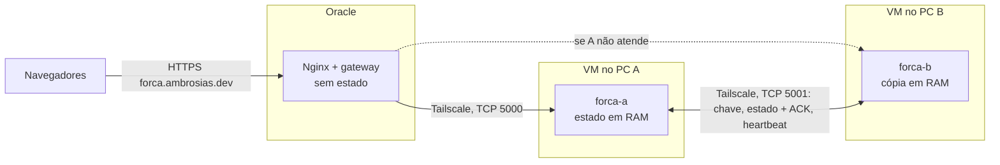

# Arquitetura — Jogo da Forca Distribuído

## Objetivo

Jogo da forca com até dois jogadores por sala, várias partidas simultâneas e continuação da mesma partida quando o nó que atende cair. Usa apenas a biblioteca padrão do Python: `socket`, `threading`, `http.server`, `json`, `hashlib`, `hmac`.

## Componentes

| Componente | Responsabilidade |
| --- | --- |
| Página (`web/`) | Tela do jogo no navegador. Guarda token, `deployment` e o comando pendente na aba; reenvia o pendente até haver resposta. |
| Gateway (`gateway.py`) | HTTP para o navegador. Sem estado: descobre qual nó atende (`PING` a cada 1 s) e encaminha cada comando sem alterá-lo. |
| Nó (`servidor.py`) | Papel dinâmico: `ENTRANDO`, `RESERVA` ou `PRIMARIO`. O primário aplica as regras sob uma trava e replica cada alteração antes de responder. |
| Regras (`forca/game.py`, `forca/lobby.py`) | Partida, salas, sessões, nomes únicos, recibos e coleta do estado. Não abrem sockets. |
| Protocolo (`forca/wire.py`) | JSON UTF-8, um objeto por linha, com limite de tamanho. |
| Vigia da rede (`forca/rede.py`) | Encerra o servidor ou o gateway se a rede do container sumir; o Docker o reinicia na rede nova. |
| Tailscale (container) | Rede privada entre as duas VMs e a Oracle, com nomes fixos (`forca-a`, `forca-b`, `forca-gateway`). |
| Docker Compose | Um nó por VM (`compose.yaml`) e o gateway na Oracle (`deploy/oracle/compose.yaml`). |
| VirtualBox | Uma VM Ubuntu em cada um dos dois PCs (requisito do trabalho). |

## Organização

Um único nó aceita alterações por vez. Os dois escutam as duas portas; quem não está atendendo responde `retry`, e o gateway passa ao outro. Não há banco de dados: cada nó guarda o estado em memória.

**Interpretação de nó:** os nós do sistema distribuído são os dois servidores em computadores físicos diferentes. O gateway é a porta de entrada e não guarda estado. As salas são estruturas de dados dentro do nó que atende, não processos separados.

## Papéis dinâmicos

| Papel | Atende? | Como chega a ele |
| --- | --- | --- |
| `ENTRANDO` | não | Ao iniciar, enquanto procura o outro nó (até 10 s) |
| `RESERVA` | não | Um primário sem reserva aceitou este nó e enviou a cópia completa |
| `PRIMARIO` com reserva | sim | Um reserva se juntou a ele; cada jogada é replicada antes da resposta |
| `PRIMARIO` sozinho | sim | Criou o jogo sem achar o outro nó, assumiu após a queda do primário, ou perdeu o reserva e esperou 7 s |
| `PRIMARIO` em espera | não | Acabou de perder o reserva; dura no máximo 7 s |

- **Um nó sozinho atende.** Ao iniciar, o nó procura o outro por 10 s. Se o outro já atende, vira reserva dele. Se os dois estão iniciando, o de nome menor cria o jogo. Se ninguém responde, cria o jogo e atende com uma cópia só.
- **Quando o outro nó entra, passa a guardar a segunda cópia.** A partir daí cada jogada é replicada antes de ser confirmada.
- **Quem volta vira reserva.** Um nó que reinicia se junta a quem está atendendo.
- **Perda do reserva:** o primário espera 7 s, mais que os 5 s que o reserva leva para assumir, e então segue sozinho. Se foi só a rede entre os nós que caiu, nesse intervalo o reserva já assumiu e o gateway já mandou os jogadores para ele.
- **Dois primários se reencontram:** fica o que confirmou mais jogadas (`revision`); no empate, a maior `epoch` e depois o menor nome. O outro descarta a própria cópia e vira reserva. O gateway usa a mesma ordem para escolher a quem encaminhar.
- `epoch` conta as promoções e `revision` as alterações; as duas são replicadas e aparecem no `PING`.

Consequência para o Docker: `restart: unless-stopped` é seguro, porque um nó que volta procura o outro antes de qualquer coisa.

O servidor e o gateway usam a rede do container `tailscale`. Se só aquele container reinicia, o processo ficaria vivo dentro de uma rede que não existe mais. A vigia (`forca/rede.py`) percebe que as interfaces sumiram e encerra o processo; a política de reinício o traz de volta já na rede nova, em cerca de 5 a 10 s.

## Entrada e comunicação

1. O navegador gera um token aleatório (32 bytes) e o guarda em `sessionStorage`: cada aba é um jogador.
2. Envia `ENTRAR` com o nome. O comando pendente é salvo antes do envio e reenviado idêntico até haver resposta.
3. O nó recusa o nome se outro jogador ativo já o usa (`NOME_EM_USO`). Depois procura uma sala com um jogador aguardando e conectado; se não houver, cria uma.
4. Com dois jogadores, a partida começa com uma palavra sorteada no nó; o primeiro a entrar começa.
5. Ao reconectar enquanto espera, a página envia `ENTRAR` de novo; se outra sala tiver alguém esperando, os dois se juntam.

Depois disso, a página envia `ESTADO` a cada 1 s e `JOGAR`, `CHUTAR` ou `SAIR` quando o jogador age. Detalhes em [docs/protocolo-etapa-1.md](docs/protocolo-etapa-1.md).

## Partidas e estado

| Dados | Conteúdo |
| --- | --- |
| Jogadores | `player_id` (SHA-256 do token), nome, sala e se está ativo |
| Salas | Participantes, palavra, letras, chutes errados, erros por jogador, turno, estado, versão, vencedor e motivo |
| Recibos | Para cada jogador, só o último comando: `request_id`, impressão digital e resultado |
| Controle | `deployment_id` da execução, `revision` global e `epoch` |

Uma trava (`threading.Lock`) torna indivisível a sequência: copiar o estado → aplicar a regra → replicar e esperar ACK → adotar a cópia → responder. Uma requisição espera no máximo 2 s pela trava; depois disso recebe `retry`. Com os tempos do gateway (leitura de 10 s) e do navegador (20 s), uma requisição só é aplicada enquanto quem a enviou ainda espera a resposta, e uma cópia atrasada não pode ser aplicada depois do comando seguinte.

**Coleta:** ao fim de cada alteração, o nó libera quem sumiu há 180 s fora de partida em andamento, apaga jogadores inativos que nenhuma sala mostra e salas encerradas que ninguém consulta. O estado replicado depende de quantos jogam agora, não do histórico. Se mesmo assim passar de 2 MB, o comando é recusado (`ESTADO_CHEIO`) sem pausar o nó.

A consulta de estado monta só a sala do jogador, não o mundo inteiro.

## Recuperação de falhas

- **Replicação síncrona:** o primário envia o estado completo ao reserva e só responde depois do ACK com a mesma revisão.
- **Sincronização inicial:** o reserva só pode se promover depois da segunda mensagem do primário, que prova que o ACK inicial chegou. Se a cópia inicial falhar, o primário não se pausa.
- **Heartbeat:** a cada 0,5 s. O primário espera 3 s; o reserva espera 5 s. O primário se pausa antes de o reserva assumir e só volta a atender sozinho 7 s depois.
- **Queda do primário:** o reserva detecta o fechamento da conexão (processo encerrado) ou o timeout (computador desligado) e assume com a última revisão.
- **Queda do reserva:** o primário se pausa por até 7 s e depois segue sozinho. Quando o reserva volta, se junta a ele e recebe a cópia.
- **Gateway e navegador:** em `retry` ou falha, o gateway tenta o outro nó; sem nenhum, responde 503 e o navegador reenvia o mesmo comando.
- **Reenvio:** os recibos são replicados; um reenvio após a troca devolve o resultado registrado sem repetir a jogada.
- **Execuções diferentes:** se os dois nós reiniciarem, o `deployment_id` muda e o navegador volta à tela de nome (`fatal`).
- **Chaves diferentes:** os nós não se sincronizam e cada um atende sozinho; os dois registram o erro no log, no máximo uma vez por minuto.

## Abandono

A presença dos jogadores é local ao nó que atende e não é replicada. Com ela o nó decide duas coisas:

- **Pausa:** partida em andamento com um participante sem consultar há 5 s aparece `PAUSADA`.
- **Vitória por abandono:** se o adversário fica 30 s sem consultar enquanto o outro jogador segue presente, a partida termina com vitória de quem ficou (motivo `ABANDONO`). A decisão sai na consulta de estado de quem ficou e é gravada como qualquer jogada: copiada, replicada e só então respondida.

O prazo conta a partir do que for mais recente: a última consulta do adversário ou o início da presença contínua de quem ficou. Depois de uma promoção ou de uma retomada, o nó esquece a presença e todos os prazos recomeçam. Assim, uma queda do gateway, uma troca de servidor ou a volta de quem também esteve fora não dão vitória a ninguém.

## Acesso e limites

A chave de replicação é comparada com `hmac.compare_digest`. O tráfego entre os nós e o gateway passa pelo Tailscale (cifrado); o público só alcança o gateway pelo HTTPS da Cloudflare. Tokens nunca são registrados em log: o gateway não registra requisições.

O modelo supõe falha por parada, uma de cada vez. Nesse modelo nenhuma jogada confirmada com as duas cópias se perde.

O projeto escolhe disponibilidade: um nó sozinho atende. O preço aparece em dois casos:

- **Jogadas confirmadas com uma cópia só** (nó sozinho) se perdem se esse nó cair antes de o outro voltar.
- **Falha só da rede entre os dois nós**, com as duas máquinas vivas: cada nó pode acabar atendendo sozinho. A espera de 7 s e a preferência do gateway fazem os jogadores irem todos para o mesmo nó no caso comum; se mesmo assim os dois receberem jogadas, ao se reencontrarem fica o que confirmou mais e as jogadas do outro são descartadas. Evitar isso por completo exige um terceiro nó como árbitro.

Se os dois nós pararem, as partidas se perdem.
