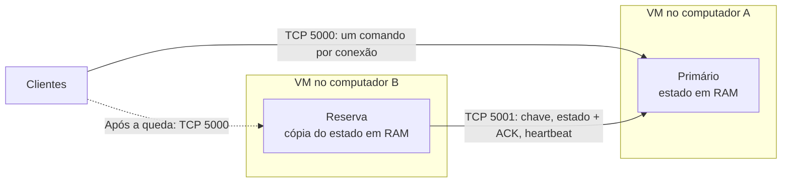

# Arquitetura — Jogo da Forca Distribuído

## Objetivo

Jogo cliente-servidor em Python, com até dois jogadores por sala, fila de espera e continuação da mesma partida quando o servidor primário cair. Usa apenas a biblioteca padrão: `socket`, `threading`, `json`, `hashlib`, `hmac` e `secrets`.

## Componentes

| Componente | Responsabilidade |
| --- | --- |
| Cliente Python no terminal (`cliente.py`) | Ler comandos, consultar o estado, desenhar os dois bonecos, guardar a sessão e reconectar ao outro servidor. |
| Servidor primário (`servidor.py`, modo `primario`) | Atender jogadores na porta 5000, aplicar as regras sob uma trava e replicar cada alteração antes de responder. |
| Servidor reserva (`servidor.py`, modo `reserva`) | Manter uma cópia do estado recebida pela porta 5001 e assumir a porta de jogadores quando o primário cair. |
| Regras (`forca/game.py`, `forca/lobby.py`) | Partida, salas, sessões, nomes únicos e recibos de comandos. Não abrem sockets. |
| Protocolo (`forca/wire.py`) | JSON UTF-8, um objeto por linha, com limite de tamanho. |
| Docker Engine + Compose | Executar o servidor de forma padronizada em cada VM. |
| VirtualBox | Uma VM Ubuntu por computador físico, com rede em modo bridge. |

Infraestrutura da apresentação: dois computadores físicos, cada um com uma VM Ubuntu no VirtualBox e um container do servidor. Os clientes rodam com Python fora do Docker, no computador que permanecerá ligado ou em outros dispositivos da mesma rede.

## Organização

Um único servidor aceita alterações por vez. O primário atende todas as salas; o reserva não abre a porta de jogadores até ser promovido. Não há banco de dados nem serviço externo: cada servidor guarda o estado em memória.

**Interpretação de nó:** os nós do sistema distribuído são os dois servidores em computadores físicos diferentes. As salas são estruturas de dados dentro do primário, não processos separados. Essa interpretação deve ser validada com o professor.

## Execução com Docker

- Um container por VM, com a mesma imagem (`python:3.12.13-slim`). O papel é definido por `MODO` no `.env`.
- `compose.yaml` publica 5000 (jogadores) e 5001 (replicação) na VM. O servidor escuta em `0.0.0.0`.
- O reserva conecta ao IP da VM primária (`PRIMARY_HOST`) na porta publicada 5001, apresentando `REPLICATION_KEY`.
- `.dockerignore` exclui `.env`, sessões e arquivos gerados da imagem; `.env.example` documenta as variáveis.
- `restart: "no"`: um antigo primário não pode voltar sozinho como ativo com o estado vazio. A recuperação entre computadores é feita pelo reserva, não pela política de reinício do Docker.

## Entrada e comunicação

1. O cliente gera um token aleatório, salva em `sessions/<nome>.json` e trava esse arquivo enquanto estiver aberto.
2. Envia `ENTRAR` com o nome ao primeiro endereço da lista (`--servers` ou `CLIENT_SERVERS`).
3. O servidor recusa o nome se outro jogador ativo já o usa (`NOME_EM_USO`). O nome de quem está há 180 s sem consultar e fora de uma partida em andamento pode ser reaproveitado. Depois, procura uma sala com um jogador aguardando e conectado.
4. Se encontrar, ocupa a segunda vaga e inicia a partida com uma palavra sorteada; o primeiro a entrar começa.
5. Se não encontrar, cria uma nova sala e o jogador aguarda.
6. Ao reconectar enquanto espera, o cliente envia `ENTRAR` de novo. Se outra sala tiver alguém esperando e conectado, o servidor junta os dois e cancela a sala antiga.

Depois disso, o cliente envia `ESTADO` a cada 0,5 s e `JOGAR`, `CHUTAR` ou `SAIR` quando o jogador digita. Cada comando abre uma conexão TCP curta, envia uma linha JSON, lê a resposta e fecha. A resposta sempre traz o estado público da sala; a palavra secreta só é enviada quando a partida termina. Detalhes em [docs/protocolo-etapa-1.md](docs/protocolo-etapa-1.md).

## Partidas e estado

O servidor valida participante, turno, versão da sala e entrada antes de aplicar uma jogada. Jogadas fora da vez ou com versão antiga são recusadas sem alterar a partida.

| Dados | Conteúdo |
| --- | --- |
| Jogadores | `player_id` (SHA-256 do token), nome, sala e se está ativo |
| Salas | Participantes, palavra, letras, chutes errados, erros por jogador, turno, estado, versão, vencedor e motivo |
| Recibos | Para cada jogador, só o último comando: `request_id`, impressão digital e resultado |
| Controle | `deployment_id` da execução e `revision` global |

A lista `forca/words.txt` é normalizada ao iniciar (acentos removidos, maiúsculas); uma linha com espaços, hífens ou números impede o servidor de subir. Letras e chutes com acento também são normalizados.

Uma única trava (`threading.Lock`) torna indivisível a sequência: copiar o estado → aplicar a regra → replicar e esperar ACK → adotar a cópia → responder. Um `BoundedSemaphore` limita a 64 as conexões simultâneas.

## Recuperação de falhas

- **Replicação síncrona:** o primário envia o estado completo ao reserva e só responde ao jogador depois do ACK com a mesma revisão. Toda alteração confirmada existe nas duas máquinas.
- **Sincronização inicial:** o reserva apresenta a chave (comparada em bytes, aceita acentos) e recebe o estado completo. Ele só pode se promover depois da segunda mensagem do primário, que prova que o ACK inicial chegou. Por isso, se a cópia inicial falhar, o primário não precisa se pausar: espera outra tentativa.
- **Heartbeat:** logo após o ACK inicial e depois a cada 0,5 s. O primário espera 3 s por resposta; o reserva espera 5 s.
- **Queda do primário:** o reserva detecta o fechamento da conexão ou o timeout e se promove (`RESERVA_PROMOVIDO`), abrindo a porta 5000 com a última revisão recebida.
- **Queda do reserva:** o primário se pausa e responde `retry` a tudo, pois não consegue obter a segunda cópia. É preciso reiniciar os dois servidores.
- **Clientes:** em erro, timeout ou `retry`, tentam o próximo endereço da lista a cada 0,5 s, mantendo token e comando pendente. Nenhuma conexão TCP antiga é transferida.
- **Reenvio:** o comando pendente mantém seu `request_id`. Os recibos são replicados; se a ação já foi aplicada, o reserva devolve o mesmo resultado sem repeti-la.
- **Entradas malformadas:** comandos inválidos recebem "Comando inválido"; uma falha inesperada é registrada no log e respondida como erro interno, sem derrubar o servidor.
- **Execuções diferentes:** o `deployment_id` salvo na sessão faz o cliente recusar um servidor de outra execução (resposta `fatal`).

## Acesso e limites

A chave de replicação é comparada com `hmac.compare_digest`; o tráfego não usa TLS e fica restrito à rede local da apresentação. Tokens ficam só nos arquivos de sessão dos clientes, fora do Git e dos logs.

O modelo supõe falha por parada, uma falha por vez, com a rede entre os equipamentos vivos funcionando. Como o primário não confirma nada sem o reserva, uma interrupção só da rede entre os servidores não gera dois históricos confirmados. Depois da promoção, porém, existe uma única cópia; não há reintegração automática do servidor que volta, e se os dois servidores pararem as partidas se perdem.
